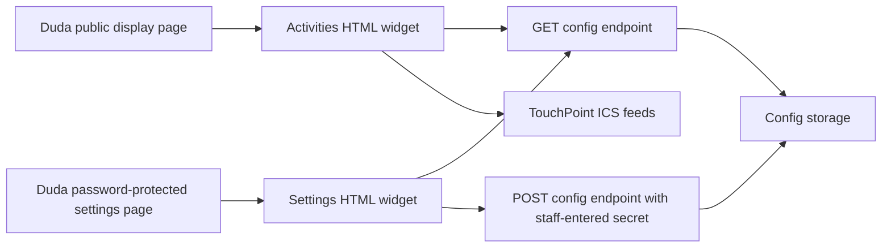

# Duda Widget Configuration Plan

## Context

The landscape Activities Today HTML code is embedded in a Duda HTML widget on the church website. It is not currently a standalone hosted application.

That matters because Duda's HTML widget is intended for trusted custom HTML, CSS, and client-side JavaScript. Duda notes that server-side scripts such as PHP or ASP do not run inside the HTML widget, and recommends client-side JavaScript, HTML, and HTTPS-hosted external assets only. Duda also notes that custom code can make the widget inaccessible in the editor, so the widget should stay isolated in its own container when possible.

Sources:

- Duda HTML Widget documentation: https://support.duda.co/hc/en-us/articles/26519240974487-Widgets-HTML
- Duda Custom Widgets introduction: https://developer.duda.co/docs/widget-introduction
- Duda Custom Widget JavaScript documentation: https://developer.duda.co/docs/javascript

## Goal

Build a configuration/settings function for the Activities Today display so approved staff can change display settings without editing the production HTML widget code directly.

Likely settings include:

- side promotion enabled/disabled
- side promotion image URL
- side promotion fit mode
- bottom banner enabled/disabled
- bottom banner image URL
- refresh interval
- max events per page
- page rotation enabled/disabled
- page rotation seconds
- show or hide feed names
- show or hide event end times
- load all feeds or only the general calendar

## Duda Password Protection Options

Duda supports password-protected pages through page access settings. The page receives a single shared password. Duda explicitly distinguishes this from user logins or account management; it is one password for the page, not separate users.

Duda also supports Membership pages if user-level access is needed. Membership can restrict pages based on whether the visitor is logged in and, with plans, which access group they belong to.

Sources:

- Duda password-protected pages: https://support.duda.co/hc/en-us/articles/26519238639383-Single-Page-Management
- Duda Membership documentation: https://support.duda.co/hc/en-us/articles/26519223937943-Membership

## Important Security Constraint

A Duda password-protected settings page can hide the settings UI from normal public visitors, but it does not make secrets inside client-side JavaScript safe.

Do not put any write-capable API key, admin token, Duda API credential, or permanent config-storage credential directly into the Duda HTML widget code. Anyone who can view the protected page in a browser can inspect the JavaScript and extract those values.

## Recommended Architecture

Use two Duda pages and one small external configuration service.

### 1. Public Display Page

The existing landscape display remains embedded in a Duda HTML widget.

Instead of hardcoding every setting in the widget, the display widget should:

1. load safe default settings from local `CONFIG`;
2. fetch a public read-only JSON config file or endpoint over HTTPS;
3. merge valid remote settings into the defaults;
4. render the calendar using the merged settings.

The public display page only needs read access. It should not contain any credentials that can change settings.

### 2. Password-Protected Settings Page

Create a Duda page such as `/activities-display-settings`.

Set page access to `Password Protected` in Duda:

1. Open Duda editor.
2. Go to `Pages`.
3. Open the page settings menu.
4. Choose `Set Access`.
5. Select `Password Protected`.
6. Enter the shared staff password.
7. Save and publish.

Place a separate HTML widget on this protected page for the settings form.

The settings form should:

- load the current config from the external configuration service;
- display editable controls for safe settings;
- validate fields before saving;
- require a save password or one-time admin token entered by the user, not embedded in JavaScript;
- send the update request to the external configuration service.

### 3. External Configuration Service

Because Duda HTML widgets cannot run server-side code, saving settings needs an external service.

Good lightweight options:

- Cloudflare Worker plus KV or D1
- Netlify Function plus a JSON file/database
- Vercel Function plus storage
- Supabase Edge Function plus table storage
- a small existing church-controlled server endpoint

The service should expose two endpoints:

```text
GET /activities-display/config
POST /activities-display/config
```

`GET` can be public if it only returns non-sensitive display settings.

`POST` must require authorization. The authorization secret should be typed into the settings form at save time or handled through a real login flow. It should not be hardcoded in the Duda page.

## Data Flow



## Suggested Config Shape

```json
{
  "version": 1,
  "updatedAt": "2026-07-18T00:00:00-05:00",
  "display": {
    "refreshMinutes": 5,
    "rotatePages": true,
    "pageRotationSeconds": 12,
    "maxEventsPerPage": 10,
    "showFeedName": false,
    "showEndTime": true,
    "loadGeneralCalendarOnly": false
  },
  "promotions": {
    "sidePanel": {
      "enabled": true,
      "title": "",
      "imageUrl": "https://example.com/side-promo.png",
      "fit": "contain"
    },
    "bottomBanner": {
      "enabled": false,
      "imageUrl": "",
      "fit": "cover"
    }
  }
}
```

## Validation Rules

The settings service should reject invalid values before saving:

- `refreshMinutes`: number between 1 and 60
- `pageRotationSeconds`: number between 5 and 120
- `maxEventsPerPage`: number between 1 and 20
- `fit`: only `contain` or `cover`
- image URLs: blank or `https://` only
- booleans: true or false only
- unknown config keys: ignored or rejected

The display widget should also validate fetched config before applying it. If the config fetch fails or returns invalid data, the display should continue using safe defaults.

## Duda-Specific Implementation Notes

- Keep the production display widget in its own Duda container or column so it can be selected and removed if custom code breaks layout/editor access.
- Use HTTPS for every external script, image, and config endpoint.
- Avoid loading another jQuery version inside the widget because Duda already uses jQuery internally.
- Treat the Duda password-protected page as convenience access control, not as the only security boundary for saving settings.
- If different staff members need individual accounts, use Duda Membership or an external login system instead of a single page password.
- Dynamic pages cannot be password-protected in Duda, so the settings page should be a normal page.

## Recommended Build Sequence

1. Keep the current landscape display embedded in the public Duda HTML widget.
2. Create a password-protected Duda settings page.
3. Build a small external config service with public read and protected write endpoints.
4. Modify the display widget to fetch and merge remote config.
5. Build the settings-page HTML widget form.
6. Test with a non-admin browser session.
7. Test failed config fetch behavior.
8. Test saving invalid settings and confirm they are rejected.
9. Test the live signage display after changing each setting.

## Open Decisions

- Which external hosting/storage option should hold the config?
- Is a shared staff save password enough, or do we need individual user accounts?
- Should promotion image uploads happen through Duda Media Manager manually, or should the settings page support upload?
- Should the public display config endpoint expose every setting, or should some values remain deploy-time only?
- Should config changes apply immediately on the next refresh, or should the settings page provide a manual publish button?

## Recommended Direction

Use Duda page password protection for the staff-facing settings page, but use a small external configuration service for actual persistence and write authorization.

This keeps Duda as the website and display host, avoids editing the production widget for routine changes, and prevents permanent write credentials from being exposed in browser JavaScript.
